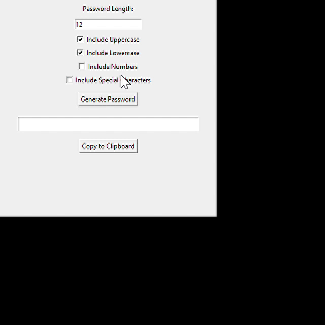

## Password Generator App

This is a simple and secure **Password Generator App** built using **Python**.  
It allows users to create strong, customizable passwords with ease!

## Features
- Generate random secure passwords.
- Choose password length.
- Option to include:
  - Uppercase letters
  - Lowercase letters
  - Numbers
  - Special characters
- Easy-to-use graphical interface (GUI) using **Tkinter**.

##  How to Run the Project
1. Make sure you have **Python** installed (version 3.x).
2. Clone this repository:
   ```bash
   git clone https://github.com/erelliushasree/password-generator-app.git
## Navigate to the project folder:
cd password-generator-app

##Run the app:
python password_generator.py

## Tools & Technologies Used
Python 3
Tkinter (for GUI)

## Advantages
Quickly generates highly secure passwords.
User can customize password based on their needs.
Very simple and lightweight.

## Disadvantages
Needs to be updated manually if security standards evolve.
Basic design (can be enhanced with frameworks like PyQt or Kivy).

## Skills Demonstrated
Python Programming
GUI Development
Randomization and Security Concepts

## Future Improvements
Add password strength meter.
Save generated passwords securely.
Dark mode theme for the app.

## Screenshots
 

### Live Demo




